# Android-Generic Project : Getting started

**On this page:**

* [1. Prerequisites](android-generic-project-getting-started.md#Gettingstarted-1.Prerequisites)
* [2. How to include Android-Generic Project into your Project:](android-generic-project-getting-started.md#Gettingstarted-2.HowtoincludeAndroid-GenericProjectintoyourProject:)
* [3. Setting Up](android-generic-project-getting-started.md#Gettingstarted-3.SettingUp)
  * [PC Instructions:](android-generic-project-getting-started.md#Gettingstarted-PCInstructions:)
* [4. Operation](android-generic-project-getting-started.md#Gettingstarted-4.Operation)
* [Build Options](android-generic-project-getting-started.md#Gettingstarted-BuildOptions)
* [Debugging](android-generic-project-getting-started.md#Gettingstarted-Debugging)
* [Tools](android-generic-project-getting-started.md#Gettingstarted-Tools)
* [Private Tools/Scripts](android-generic-project-getting-started.md#Gettingstarted-PrivateTools/Scripts)

## **1. Prerequisites** <a id="Gettingstarted-1.Prerequisites"></a>

You will need to have synced AOSP source for Android 11, or a ROM prior to adding this to your build environment.

For PC builds \(so far\):

```text
- BlissROM
- AOSP
- WIP - Lineage OS
```

Please make sure you're well versed in building AOSP: [AOSP building instructions](http://source.android.com/source/index.html) before proceeding.

**What you need to build with**

**System Requirements**

```text
Latest Ubuntu LTS Releases https://www.ubuntu.com/download/server
Decent CPU (Dual Core or better for a faster performance)
8GB RAM (16GB for Virtual Machine)
250GB Hard Drive (about 170GB for the Repo and then building space needed)
```

**Installing Java 8**

```text
sudo apt-get update && upgrade
sudo apt-get install openjdk-8-jdk-headless
update-alternatives --config java (make sure Java 8 is selected)
update-alternatives --config javac (make sure Java 8 is selected)
```

**Grabbing Dependencies**

```text
sudo apt-get install git-core gnupg flex bison maven gperf build-essential zip curl zlib1g-dev gcc-multilib g++-multilib libc6-dev-i386  lib32ncurses5-dev x11proto-core-dev libx11-dev lib32z-dev ccache libgl1-mesa-dev libxml2-utils xsltproc unzip squashfs-tools python-mako libssl-dev ninja-build lunzip syslinux syslinux-utils gettext genisoimage gettext bc xorriso libncurses5 xmlstarlet build-essential git imagemagick lib32readline-dev lib32z1-dev liblz4-tool libncurses5-dev libsdl1.2-dev libxml2 lzop pngcrush rsync schedtool python-enum34 python3-mako libelf-dev
```

If you plan on building the kernel with the NO\_KERNEL\_CROSS\_COMPILE flag, you will need to also have gcc-10+ installed:

```text
sudo apt-get install gcc-10 g++-10
```

## **2. How to include Android-Generic Project into your Project:** <a id="Gettingstarted-2.HowtoincludeAndroid-GenericProjectintoyourProject:"></a>

Including AGP into your AOSP based project is as simple as cloning it into a vendor folder. 

```text
git clone https://github.com/vendor_ag vendor/ag 
```

## **3. Setting Up** <a id="Gettingstarted-3.SettingUp"></a>

Once the project is cloned, all you have to do is a couple small commands to get things going. 

### **PC Instructions:** <a id="Gettingstarted-PCInstructions:"></a>

\(pc only for now, gsi & emu will be added back soon\)

```text
. build/envsetup.sh
 ag-menu pc
```

That's it! It will initially generate the menu items with what is available for modules on initial launch

## **4. Operation** <a id="Gettingstarted-4.Operation"></a>

Now we can go step-by-step through the next few steps and learn how to operate AGP

1. **Generate Base \(GUI/Legacy\)** 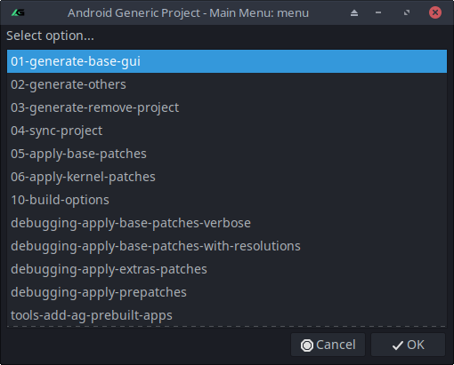 This step will walk through a couple options asking questions in order to set up your build properly.  Device Type Selection 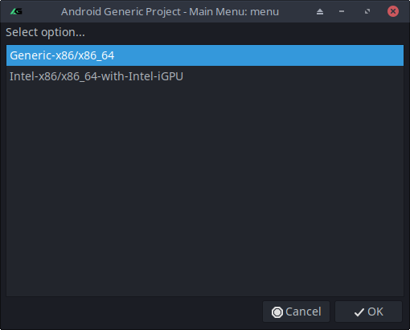 It will ask to select between the available device type options \(Currently only Generic and Intel\): Generic x86/x86\_64 or Intel x86/x86\_64 with Intel iGPU After making your selection, press OK. Or cancel to go back to the main menu  Kernel Type Selection 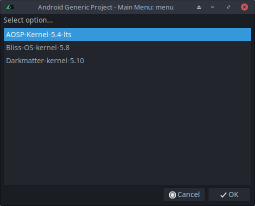 This will show the current selection of available pre-patched or un-patched upstream kernels. After making your selection, press OK. Or cancel to go back to the main menu 
2. **Generate Others**  
   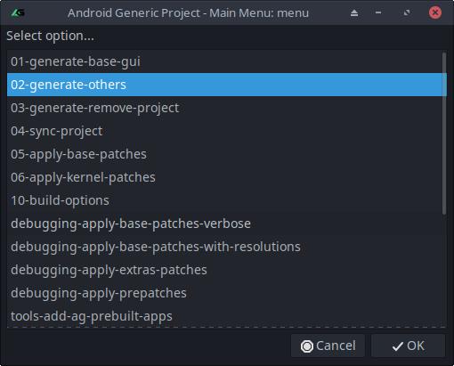

   This will take you through the setup of generating the options that fall into the "Others" category. This step is automated, but still needs to be initiated. 

3. **Generate Remove Project**  
   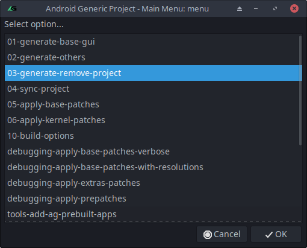

   This will go through your current projects manifests folder, and generate a removes.xml with all the projects required to remove from your project for PC builds. This is automated, but might also take a few minutes.   


   **After the above steps are all complete, we are ready to sync the new manifest.xml files that are found in your projects .repo/local\_manifests folder. To do that, we added** 

4. **Sync Project**  
   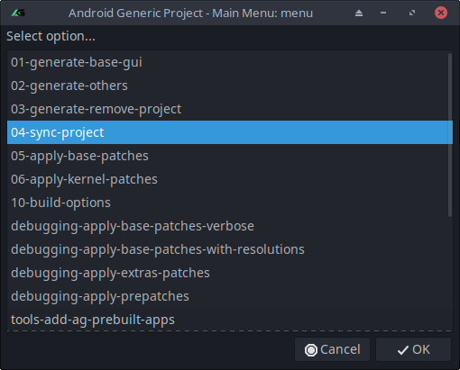

   At this point, you may see "fatal: remove-project element specifies non-existent project: ........."  
   This means that your project has removed an item from manifest a different way than we were expecting from the scripts.  
   Solution: cd into .repo/local\_manifests/01-remove.xml and comment out the line the sync script was complaining about  
   If any other errors show up with sync, try to manually run:

   ```text
   repo sync --force-sync -j4
   ```

   **Once the project has completed successfully, we can continue onto the next step**  

5. **Apply Base Patches**  
   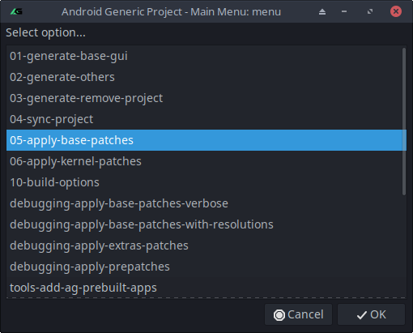

   If your project is close to AOSP, then this step should be 100% automatic and no "Conflicts" will show up. Otherwise, there is a chance things will start to require some actual work here. If you do happen to get any patches that show as "Conflicts" here, follow these instructions:  

6. **Apply Kernel Patches**

   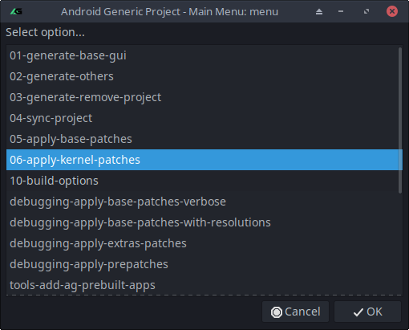  
   This will launch the Kernel Patching menu where you will need to select what target kernel you synced in order to apply the proper patches to it. This only applies to Upstream Linux/Google kernel branches that don't have our patches pre-applied. 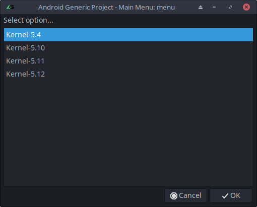

7. **Build Options**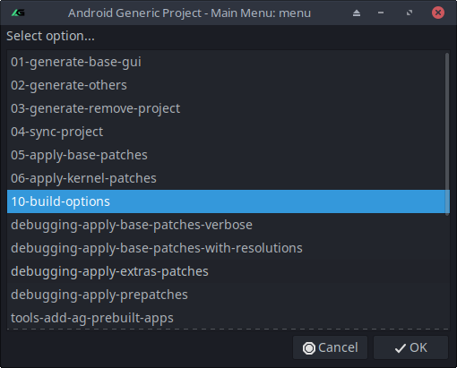

   This will launch the main build menu, which contains all the options related to the build commands. 

## Build Options <a id="Gettingstarted-BuildOptions"></a>

This menu will show the various build options for compiling your project through AG. 

* **Select Product Type** 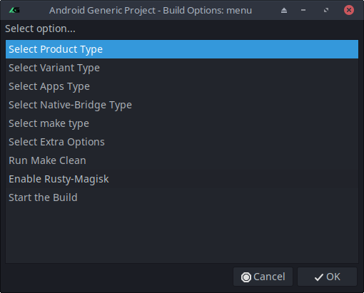 Selecting this will ask you what device type you plan on targeting \(PC: android\_x86 / android\_x86\_64\) 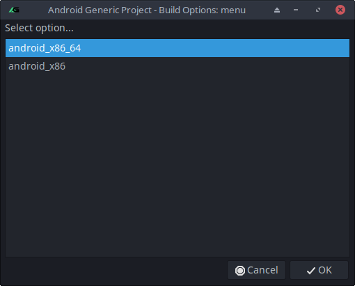
* **Select Variant Type**  
  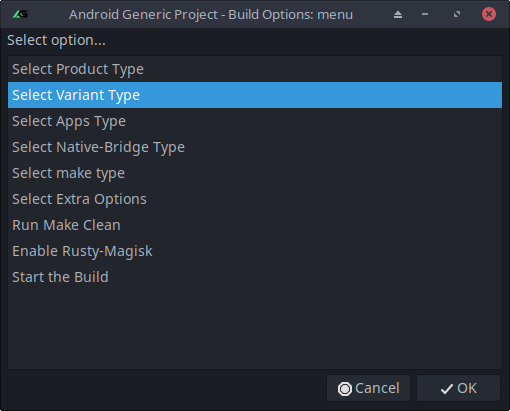

  Selecting this will ask you what build variant type you plan on targeting \(user, userdebug, eng\)  
  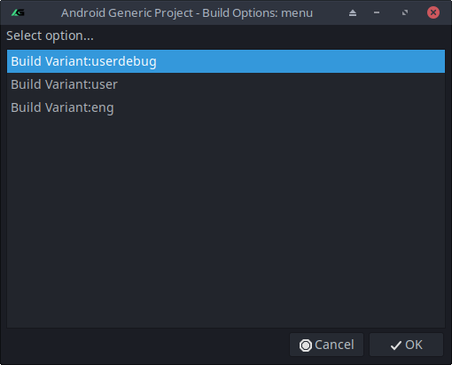

* **Select Apps Type**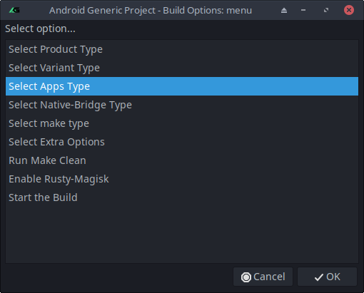

  Selecting this will present the options for included Apps type

  **FOSS** - Free & Open Source apps from Aurora Droid & Aurora Store \(and microG client\) \(x86/x86\_64/arm64\)  
  **GMS** - not implemented by default  
  **EMU-Gapps** - Proprietary gapps extracted from Google's Emulator images. \(x86\_64 only\)  
  **Vanilla** - No added apps or services  

* **Select Native-Bridge Type**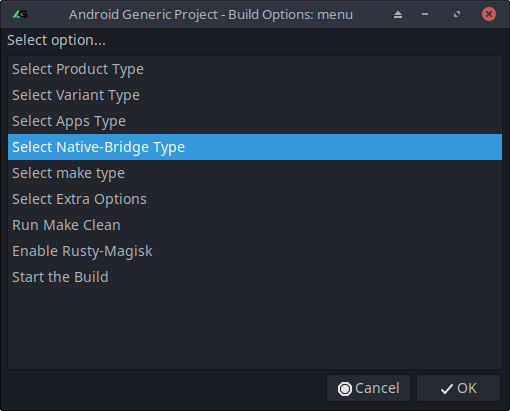

  Selecting this will present the options for Native-Bridge.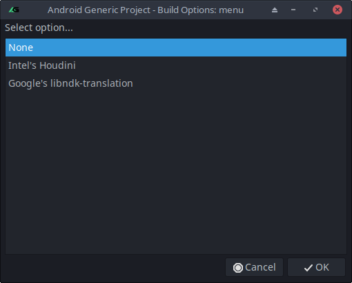

  **None** - No changes to Native Bridge aside from what Android-x86 includes by default  
  **Intel's Houdini** - Will pull the latest supported ChromeOS recovery image, and extract the Houdini & Widevine files from that and include in your build.  
  **Google's libndk-translation** - Will need manual setup of vendor/google/emu-x86 before using. Follow readme from that project \(we were unable to reproduce results of extracting super.img automatically\)  

* **Select Make Type**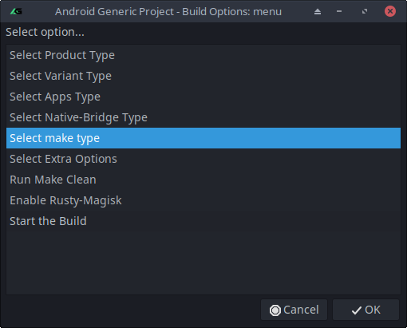

  Selecting this option will allow you to choose what kind of final image you would like. 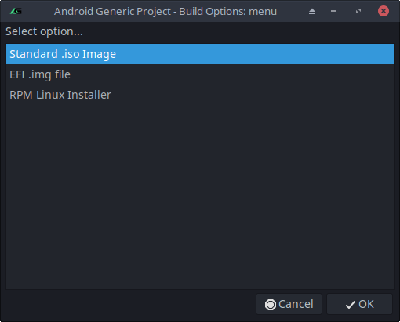

  **Standard .iso Image** - generic .iso for MBR/EFI  
  **EFI .img file** - Builds .iso for using in EFI devices  
  **RPM Linux Installer** - Compiles as an .rpm installer for linux based systems and will install in a folder on the linux drive.   

* **Select Extra Options**

  This will contain only options that can be interchangeable \(affected with only an export or build environment variable\)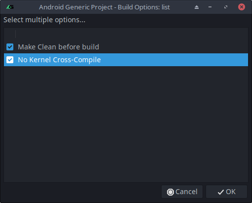

  **Make Clean Before Build** - Will add "make clean" to your build command and have it run every time you start the build.   
  **No Kernel Cross-Compile** - Will add the override for NO\_KERNEL\_CROSS\_COMPILE and allow you to build the kernel using GCC 10/11 from your installed system instead of using AOSP or your ROM's GCC  

* Run Make Clean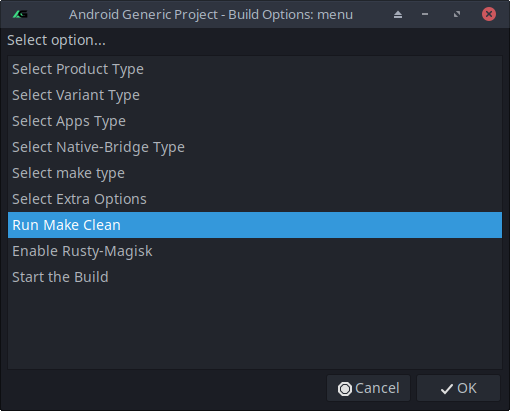

  Selecting this will immediately run the "make clean" command on your project. Clearing the PRODUCT\_OUT folder  

* Enable Rusty-Magisk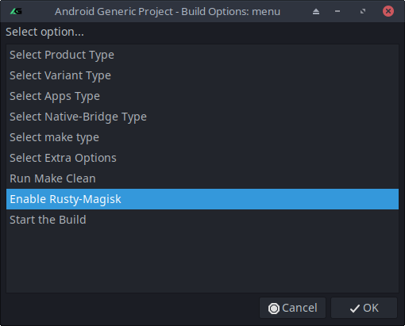

  Based on what Product you selected prior to selecting this option, the script will compile the resources needed to include Rusty-Magisk into your build  

* Start The Build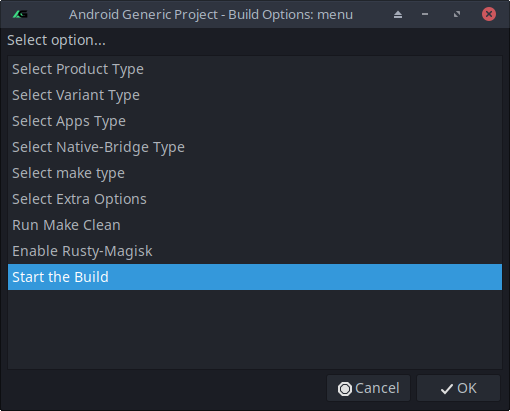

  This command is dependent on all previous options and will also save/reload your last used build command \(all the options selected in this section above\), then run the build command in the terminal.  
  From this point forward, any errors will need to be resolved manually. 

## **Debugging** <a id="Gettingstarted-Debugging"></a>

* **Resolving Patch Conflicts**

  First off, we include two redundant methods for applying patches beyond the base patches script.   
  
  **Apply Base Patches with Resolutions:**  
  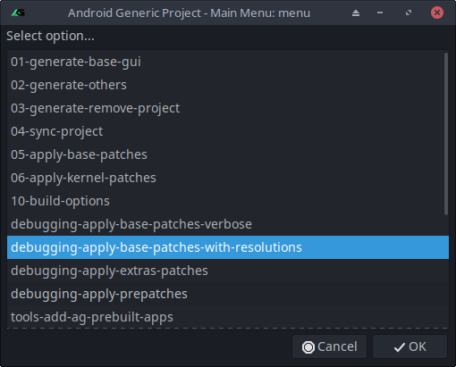  
  This will search through each set in vendor/ag/utils/android\_r/google\_diff/x86-resolutions/set\# and attempt to apply any resolutions found after one of the base patches has a conflict.  
  
  **Apply Base Patches Verbose:**  
  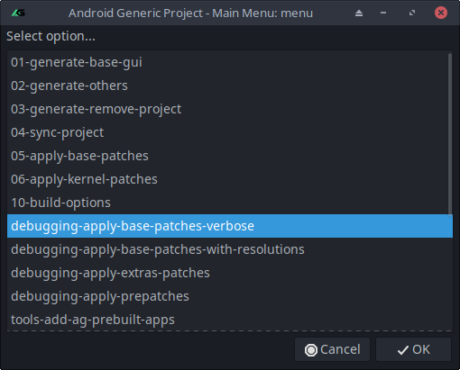  
  This will run through the base set of patches, and offer a more verbose patching method. This script will leave a lot to manual work.   
  
  **Manual Patch Resolution:**   
  You will want to then make a copy of all the results of the patch scripts \(Copy and paste the contents of the terminal output into a Notepad or text document\). Each of the patches applied either resulted in "Applying", "Already applied", or "Conflicts". The only ones we want to pay attention to here are the "Conflicts", but only half of them.

  Some of the patches have duplicates for different vendor setups. So you will sometimes get results that look like this:

  ```text
  Conflicts          system/core/0015-Bliss-init-don-t-bail-out-even-no-SELinux-domain-defined.patch
  Applying          system/core/0015-Tesla-init-don-t-bail-out-even-no-SELinux-domain-defined.patch 0
  ```

  Notice how the one starting with "0015-Bliss-" failed, but the patch starting with "0015-Tesla-" applied correctly? If that happend on your vendor setup, you can ignore that patch. But if you only see one patch that had a "Conflicts", that will need to be applied and fixed.

  First, you apply the patch manually:

  ```text
  git am "__patchLocationHere__"
  ```

  You can expect that to fail, but it's crutial to the next step. Next you patch the file again, but using the "patch" command

  ```text
  patch -p1 < "__patchLocationHere__"
  ```

  This will generate the .orig & .rej files to help narrow down what you need to fix. Once the conflicting parts \(what's in the .rej files\) are resolved, delete the .rej & .orig files, then stage the files:

  ```text
  git add -A
  ```

  Then we can continue the staged git am commit from the first step:

  ```text
  git am --continue
  ```

  After applying the patch\(s\) to your local project folder, remember to generate the patch needed to resolve that conflict:

  ```text
  git format-patch -1
  ```

  Then copy the patch to the appropriate vendor folder for the conflict. Any patches that are needed to be done to the ROM before applying the generic set of patches will go to the prepatch folder \(pc\_vendor\_prepatches/treble\_vendor\_prepatches\), while any conflicts that happened from the generic patches themselves should go to the vendor\_patches folder \(pv\_vendor\_patches/treble\_vendor\_patches\) Example:

  ```text
  cp system/core/0001-init-don-t-bail-out-even-no-SELinux-domain-defined.patch vendor/android-generic/patches/google_diff/x86/pc_vendor_patches/__YourVendorName__/patches/system/core/0015-init-don-t-bail-out-even-no-SELinux-domain-defined.patch
  ```

* \(Bliss/Lineage/Others\)  Apply Extras Patches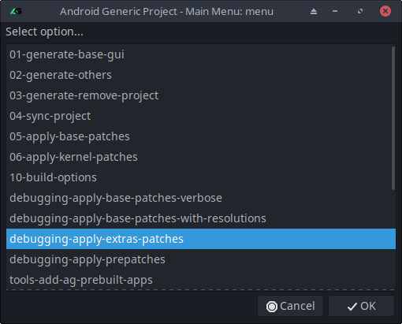

  Selecting this will apply any patches that have been added to vendor/ag/utils/android\_r/google\_diff/x86-extras/  
  These have a number of patches for Bliss and LineageOS based projects.  

* \(Bliss/Others\) Apply Prepatches

  This will apply any of the pre-patches added to vendor/ag/utils/android\_r/google\_diff/x86-prepatch/ \(Mostly only needed for Bliss so far\)

## **Tools** <a id="Gettingstarted-Tools"></a>

There are various tools we added to help add/maintain/troubleshoot. Those are all listed below

* **Add AG Prebuilt Apps** This will clone the AGP Prebuilts repo into your project and link to your build. This includes: **Set Orientation** - A manual screen rotation control for Android **Taskbar** - The featured "Desktop Mode" for Bliss OS created by @farmerb  **Taskbar Support Library** - A secondary app for Taskbar that contains permissions and defaults for how Taskbar runs on Bliss OS **Google Webview** - A version we have confirmed working on our PC builds \(Many ROM's include a version of Webview that does not play nice with PC builds\) \(FOSS ONLY\) - **AuroraServices** - a secondary app for Aurora Store/Droid that allows a more seamless install experience.  **Wallpaper Overlays** - Will also include any wallpapers added to the drawable folders in vendor/prebuilts/agp-apps/overlay/frameworks/base/core/res/res/ 
* **Add Boringdroid** This will clone in all the repos required to add Boringdroid System UI to your build, and automatically patch frameworks/base with the required additions 
* **Add Gearlock** This will clone in Gearlock and will automatically launch it's scripts when you start your build command  
* **Generate Permissions** This tool is meant to help figure out the various permissions that .apk's ask for, and will generate a private permissions .xml for any single \(or batch folder of\) apk files. will ask you to select a folder of prebuilt .apk files, and then select a permissions folder/filename to contain the resulting permissions.xml  
* **Grab Modules** When updating/adding on new scripts to use with AGP, this will reload the modules list and relaunch the menu \(mostly redundant now as the menu reloads the list automatically\) 
* **Manifest Backup** This will take all the repos currently included in your project and generate a manifest.xml with revisions included in order to easily share your project with others. 

## Private Tools/Scripts <a id="Gettingstarted-PrivateTools/Scripts"></a>

This project supports an array of proprietary and enterprise functions that will be included in vendor/ag/private-scripts/ which is only accessible through licensed access to our private AGP repos. In the Public repo for AGP, you will see a placeholder script that does nothing:

* **license-to-access-enterprise-tools**

If you do have access to the AGP private repos, all the scripts included in your license will show up at the bottom of the main menu. For example, in the screen below, we have three scripts:  
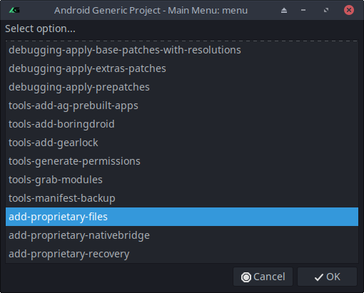

* **Add Proprietary Files** - Will let you include proprietary vendor files or prebuilts to be included in your build
* **Add Proprietary Native-Bridge** - Will allow you to include a vendor licensed native-bridge, like Intel's Houdini
* **Add Proprietary Recovery** - Will add your customized recovery image \(Recovery development contract required\)
* And more...

