# Android-Generic Project : Using With Bliss OS Source:

## **1. Setting up the environment** <a id="UsingWithBlissOSSource:-1.Settinguptheenvironment"></a>

This first part will go over the steps needed to sync and setup your Build Environment for Bliss OS 14.3 source. If you have done that already, you can skip to the next section.  
Setting up your build environment can also be done the easy way , and for that, we can use EZ-AOSP. For Ubuntu, use [MikeCrigs' repo](https://github.com/mikecriggs/ez-aosp), or for MX-Linux, use [My repo](https://github.com/electrikjesus/ez-aosp), and continue at “Grabbing the Source” when done. Otherwise, we have the manual steps below.

**System Requirements**

```text
Latest Ubuntu LTS Releases https://www.ubuntu.com/download/server
Decent CPU (Dual Core or better for a faster performance)
8GB RAM (16GB for Virtual Machine)
250GB Hard Drive (about 170GB for the Repo and then building space needed)
```

**Installing Java 8**

```text
sudo apt-get update && upgrade
sudo apt-get install openjdk-8-jdk-headless
update-alternatives --config java (make sure Java 8 is selected)
update-alternatives --config javac (make sure Java 8 is selected)
```

**Grabbing Dependencies**

```text
sudo apt-get install git-core gnupg flex bison maven gperf build-essential zip curl zlib1g-dev gcc-multilib g++-multilib libc6-dev-i386  lib32ncurses5-dev x11proto-core-dev libx11-dev lib32z-dev ccache libgl1-mesa-dev libxml2-utils xsltproc unzip squashfs-tools python-mako libssl-dev ninja-build lunzip syslinux syslinux-utils gettext genisoimage gettext bc xorriso libncurses5 xmlstarlet build-essential git imagemagick lib32readline-dev lib32z1-dev liblz4-tool libncurses5-dev libsdl1.2-dev libxml2 lzop pngcrush rsync schedtool python-enum34 python3-mako libelf-dev
```

If you plan on building the kernel with the NO\_KERNEL\_CROSS\_COMPILE flag, you will need to also have gcc-10+ installed:

```text
sudo apt-get install gcc-10 g++-10
```

**Setting up your credentials**

The first thing you should do when you install Git is to set your user name and email address. This is important because every Git commit uses this information, and it’s immutably baked into the commits you start creating:

```text
$ git config --global user.name "John Doe"
$ git config --global user.email johndoe@example.com
```

**Grabbing the Source**

\(This is where EZ-AOSP leaves off\)

We will need to create a folder for our project, then init the manifest, and sync the repo, and we do all that in a few simple terminal instructions:

```text
mkdir blissos-r36
cd blissos-r36
repo init -u https://github.com/BlissRoms-x86/manifest.git -b r11-r36
repo sync -c --force-sync --no-tags --no-clone-bundle -j$(nproc --all) --optimized-fetch --prune
```

Although we are doing our best to help you learn, it never hurts to become a bit more versed in building AOSP. so be sure to also check out: [AOSP building instructions](http://source.android.com/source/index.html)

## **2. How to include Android-Generic Project into your Project:** <a id="UsingWithBlissOSSource:-2.HowtoincludeAndroid-GenericProjectintoyourProject:"></a>

Now all we have to do is clone AGP into the vendor folder. 

```text
git clone https://github.com/vendor_ag vendor/ag 
```

## **3. Using AGP with Bliss OS** <a id="UsingWithBlissOSSource:-3.UsingAGPwithBlissOS"></a>

Now that AGP is cloned into the project, we start it up like so:

```text
. build/envsetup.sh
 ag-menu pc
```

That's it! It will initially generate the menu items with what is available for modules on initial launch

Since Bliss OS is already setup as a project, we don’t really need to use any of the other “Project Setup” options \(01-06\), and we will normally go straight to option 10-build-options. Double click on that.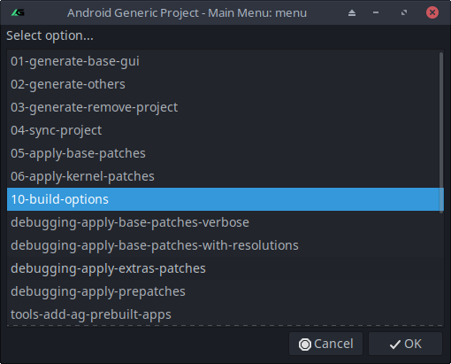

This will launch the main build menu, which contains all the options related to the build commands. From here, things pretty much match the main AGP instructions. Here’s a quick rundown of what they all do from here:

## **Build Options** <a id="UsingWithBlissOSSource:-BuildOptions"></a>

This menu will show the various build options for compiling your project through AG. 

* **Select Product Type**  


  
  Selecting this will ask you what device type you plan on targeting \(PC: android\_x86 / android\_x86\_64\)

  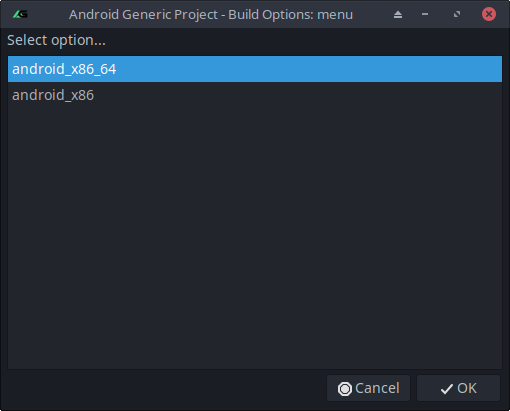

* **Select Variant Type**

  Selecting this will ask you what build variant type you plan on targeting \(user, userdebug, eng\)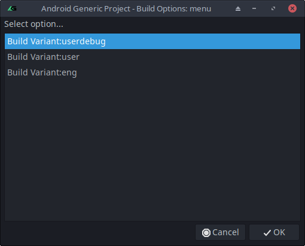

* **Select Apps Type**

  Selecting this will present the options for included Apps type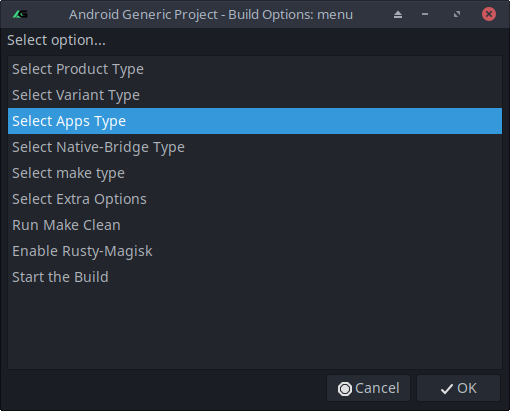

  **FOSS** - Free & Open Source apps from Aurora Droid & Aurora Store \(and microG client\) \(x86/x86\_64/arm64\)  
  **GMS** - not implemented by default  
  **EMU-Gapps** - Proprietary gapps extracted from Google's Emulator images. \(x86\_64 only\)  
  **Vanilla** - No added apps or services

* **Select Native-Bridge Type**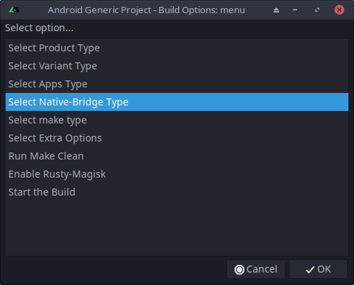

  Selecting this will present the options for Native-Bridge.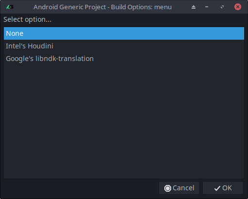

  **None** - No changes to Native Bridge aside from what Android-x86 includes by default  
  **Intel's Houdini** - Will pull the latest supported ChromeOS recovery image, and extract the Houdini & Widevine files from that and include in your build.  
  **Google's libndk-translation** - Will need manual setup of vendor/google/emu-x86 before using. Follow readme from that project \(we were unable to reproduce results of extracting super.img automatically\)

* **Select Make Type**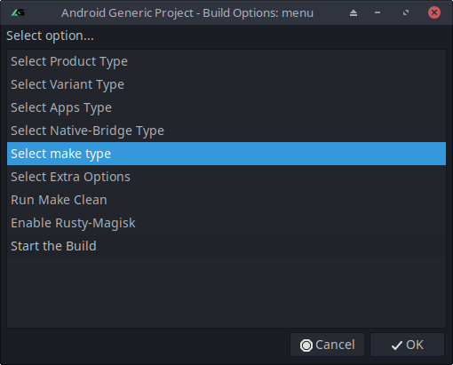

  Selecting this option will allow you to choose what kind of final image you would like. 

  **Standard .iso Image** - generic .iso for MBR/EFI  
  **EFI .img file** - Builds .iso for using in EFI devices  
  **RPM Linux Installer** - Compiles as an .rpm installer for linux based systems and will install in a folder on the linux drive. 

* **Select Extra Options**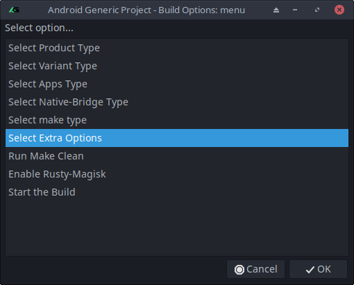

  This will contain only options that can be interchangeable \(affected with only an export or build environment variable\)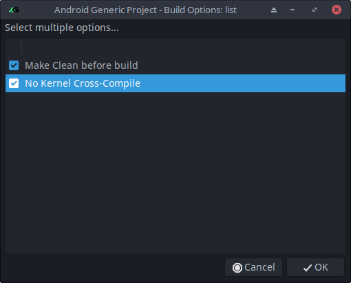

  **Make Clean Before Build** - Will add "make clean" to your build command and have it run every time you start the build.   
  **No Kernel Cross-Compile** - Will add the override for NO\_KERNEL\_CROSS\_COMPILE and allow you to build the kernel using GCC 10/11 from your installed system instead of using AOSP or your ROM's GCC

* Run Make Clean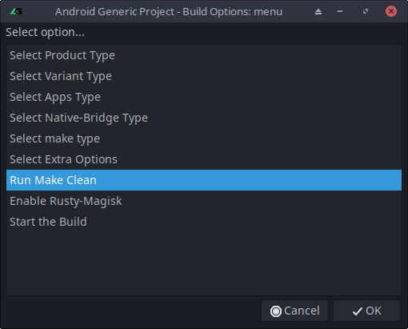

  Selecting this will immediately run the "make clean" command on your project. Clearing the PRODUCT\_OUT folder

* Enable Rusty-Magisk

  Based on what Product you selected prior to selecting this option, the script will compile the resources needed to include Rusty-Magisk into your build

* Start The Build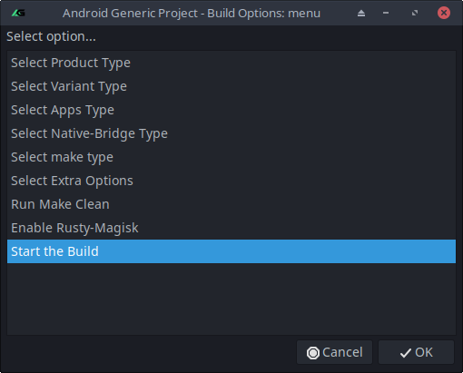

  This command is dependent on all previous options and will also save/reload your last used build command \(all the options selected in this section above\), then run the build command in the terminal.  
  From this point forward, any errors will need to be resolved manually. 

